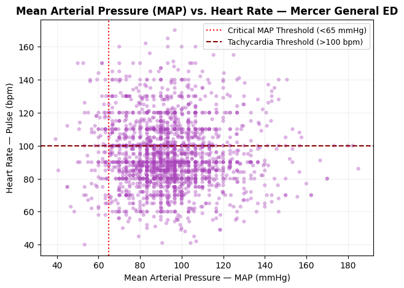

# CariSurg Portfolio (Week 0)

This repository documents my progress during Week 0 of the CariSurg MedTech Pathways Programme, focusing on clinical data processing.

## 📌 Overview
This week focuses on developing foundational skills in clinical data processing, including setting up tools such as Google Colab, Python, and GitHub, and performing initial data exploration, cleaning and producing clinically meaningful visualizations. It also introduces basic exploratory data analysis (EDA) on a sample emergency department triage dataset.

## 🎯 Objectives
- Set up a working environment (Colab + GitHub)
- Load and explore a clinical dataset using Python
- Create basic and clinically meaningful visualizations to aid patient assessment.
- Understand and explain key clinical vital signs
- Develop a simple rule to identify at-risk patients

## Tools Used
- Python (Google Colab)
- Pandas
- Matplotlib
- GitHub

## 📊 Dataset
The dataset used is a reduced,anonymous emergency department triage dataset containing patient demographics and vital signs.

**Note:** The dataset contains intentionally "dirty" values (inconsistent formats, invalid entries, and out-of-range values) to simulate real-world clinical data issues.

## ✅ Week 0 Progress
- Completed environment setup using Google Colab and GitHub
- Loaded and explored a clinical triage dataset
- Cleaned the Gender column into a consistent numerical format (1 = Male, 0 = Female)
- Performed advanced data cleaning on multiple clinical columns (GCS, SBP, Temperature, and pulse)
- Applied clinical reference ranges to identify and handle invalid values
- Used median imputation to handle missing data
- Data Visualization(Critical Care Focus):
  *Temperature Histogram:* Mapped distribution thresholds targeting pyrexia (>38.0°C) and hypothermia (<36.0°C) parameters for automated sepsis screening logic.
  *MAP vs. Pulse Scatter Plot:* Combined Mean Arterial Pressure against heart rate limits to isolate and visualize patients in critical compensatory shock quadrants.

## Cleaning Approach
For each clinical column, I followed a structured data cleaning process:
- Inspected values using unique values and summary statistics
- Converted data types to numeric format
- Applied clinical reference ranges to identify invalid values
- Replaced invalid values with NaN
- Used median imputation to handle missing data
- Verified results after cleaning

Clinical reference ranges were based on tutorial guidance and standard physiological limits.

## 🚀 How to Run
1. Open the notebook in Google Colab
2. Ensure EmergencyTriageDataset_Reduced_Dirty.csv is uploaded to your Colab environment or mount your Google Drive to match your environment pathing: `/content/drive/MyDrive/ColabNotebooks/`
3. Ensure your local directory contains `EmergencyTriageDataset_Reduced_Dirty.csv`.
4. Run all cells from top to bottom
5. The outputs will display cleaned data and summaries

## 📊 Clinical Visualisation Dashboard

Below are the key diagnostic plots generated from the cleaned triage data, mapping patient distributions against critical care thresholds:

| 1. Infection/Sepsis Screening | 2. Hemodynamic Shock Tracking |
| :---: | :---: |
|  |  |
| **Temperature Histogram:** Tracks patients crossing pyrexia (>38°C) and hypothermia (<36°C) lines. | **MAP vs. Pulse Scatter:** Highlights high-acuity patients landing in the upper-left shock crosshair. |

## 👤 Author
Shamika Glasgow 
